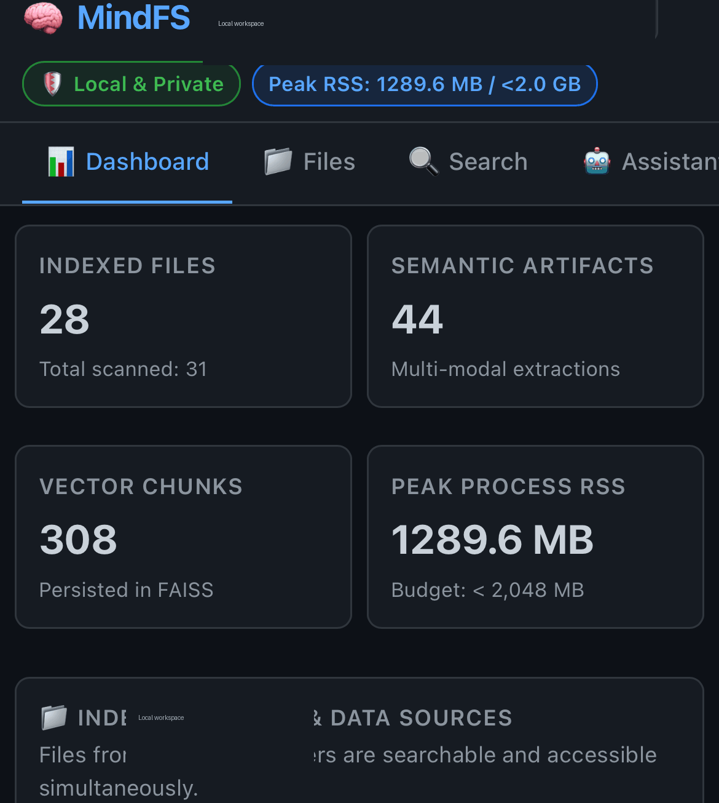
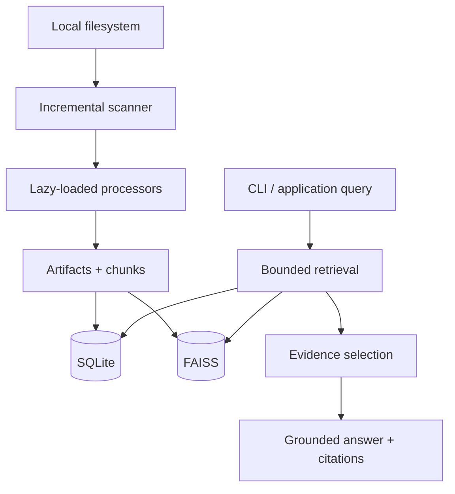

<p align="center">
  
</p>

# MindFS

**A local, privacy-first filesystem intelligence engine designed for constrained hardware.**

MindFS indexes documents, structured data, media, archives, and binaries; extracts searchable artifacts; and answers questions using evidence-grounded retrieval. The system is designed around a strict **2 GB RAM budget** with measured benchmark diagnostics reported by the project.

## See MindFS in action

A short product walkthrough: **index → ask → review → approve → execute → audit/undo**.

<p align="center">
  
</p>

### 1. Index & inspect

The dashboard exposes indexed files, semantic artifacts, vector chunks, resource usage, and indexed workspace roots at a glance.

### 2. Ask the agent

The local intelligence agent explores the indexed workspace and turns a natural-language request into a concrete proposed action plan.

### 3. Review & approve

Mutating filesystem operations are surfaced explicitly before execution, with **Approve & Execute** and **Reject / Cancel** controls.

### 4. Audit & undo

Completed mutations are recorded in the audit history, with an available **Undo** path for reversible operations.

> **Core interaction model:** intent → plan → explicit approval → execution → audit → undo.

## Why MindFS

Filesystem intelligence has two hard constraints that typical cloud RAG systems often avoid:

1. Files may be sensitive and should remain local.
2. A large heterogeneous filesystem cannot be treated as one giant in-memory document.

MindFS addresses these with sandboxed filesystem access, modular processors, incremental indexing, persistent metadata/vector stores, and bounded evidence retrieval.

## Key capabilities

- **Filesystem sandboxing** — workspace containment rejects traversal, absolute escapes, and external symlinks.
- **Modular processing** — specialized processors handle text, PDF, structured data, images, audio, video, archives, binaries, and unknown files.
- **Incremental indexing** — fingerprints `(canonical_path, size, mtime_ns, sha256)` allow unchanged files to be skipped and deleted files to be purged.
- **Dual persistence** — SQLite is the authoritative metadata store and FAISS provides CPU vector search mapped back to stored chunks.
- **Evidence-grounded answers** — retrieval is bounded and responses retain exact source provenance.
- **Resource diagnostics** — benchmark tooling measures memory and latency across core operations.

## Architecture



The key architectural boundary is that **filesystem access, processing, persistence, retrieval, and answer generation are separate concerns**. Retrieval should provide evidence; the answering layer should not manufacture unsupported facts.

## Processors

MindFS currently documents specialized processors for:

- Text and source code
- PDF with page provenance
- JSON, YAML, XML, CSV/TSV
- Images and EXIF/OCR metadata
- Audio and timestamped transcripts
- Video metadata and sparse keyframes
- ZIP/TAR/GZ archives with expansion-bomb protection
- ELF, Mach-O, PE, WASM, and Java bytecode inspection
- Unknown/binary fallback analysis

Processors are lazy-loaded so a query or indexing operation does not require every heavy dependency to be active at once.

## Quick start

Requirements: Python 3.11+.

```bash
git clone https://github.com/anonyxhappie/MindFS.git
cd MindFS
python3 -m venv .venv
source .venv/bin/activate
pip install -e .
```

Initialize and index a workspace:

```bash
mindfs -w /path/to/workspace init
mindfs -w /path/to/workspace index
mindfs -w /path/to/workspace search "Apollo database migration"
mindfs -w /path/to/workspace ask "What database backend is planned for Project Apollo?"
```

Useful diagnostics:

```bash
mindfs -w /path/to/workspace status
mindfs -w /path/to/workspace diagnostics
mindfs -w /path/to/workspace rebuild
```

## Testing and benchmarks

Run the automated tests:

```bash
python -m pytest -v
```

Run the benchmark suite:

```bash
python benchmarks/run_benchmarks.py
```

The repository currently documents a 34-item automated test suite and a benchmark suite covering 12 core operations. Treat performance numbers as measurements from the repository's benchmark environment rather than universal guarantees.

## Design priorities

- **Privacy first** — process local files without requiring cloud storage.
- **Deterministic boundaries** — filesystem containment and evidence selection should be enforceable rather than prompt conventions.
- **Incremental work** — avoid reprocessing unchanged data.
- **Explicit provenance** — answers should remain traceable to source artifacts.
- **Constrained resources** — design for small-memory local deployments.

## Project status

MindFS is an actively developed project. Interfaces and implementation details may evolve; benchmark claims should be regenerated when the runtime or processing pipeline changes.

## License

See the repository license and package metadata for the current licensing terms.
